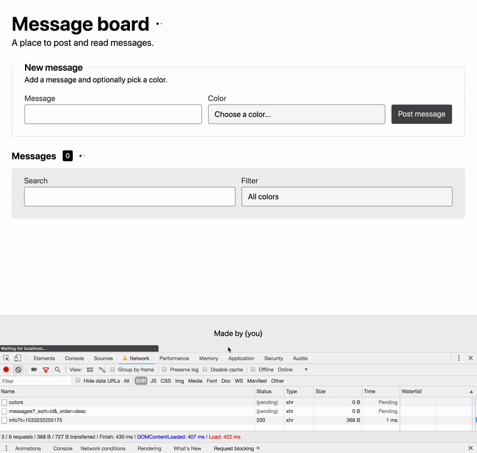

# Red Guava front-end test: Message board

We would like to move the Cliniko front-end entirely out of Rails and get all of the data from our API. We'd like to have granular control over how data on the page loads. The point of this is to see how you choose to build the components and handle asynchronous data flows.

## What is it

A one page message board app. You can view, post, search, and filter messages.

## Your TODO

- Please turn this page into modular components.
- The list should be sorted in descending order by `id`.
- In the new message form, the message field is required.
- The validation message should show after blur if the message is empty.
- Searching and filtering should send network requests when the input or select is changed.
- Show network activity in the UI

### Network activity indicators

There are 4 loading indicators on this page.

1.  The one at the top in the page header should show any IO network activity taking place on the whole page.
2.  The one in the `Post message` button should show while the message POST request is processing.
3.  The one next in the Messages list header should show when the list is waiting on a network request.
4.  And the one inside the search field should load when a search query is being processed.

## API

The list of messages and colors should be pulled from an API that is running in the background. You can see the endpoint at http://localhost:8080/api/messages and http://localhost:8080/api/colors. The API is powered by [json-server](https://github.com/typicode/json-server).

The only params you should need are `?_sort=id&_order=desc&q=searchText&color=filteredColor`. There's no need to implement any of the other operators. Just `=` is fine.

The server is intentionally running with a slightly painful delay of 800ms for every request. This makes it easier to see the asynchronous requests in the UI.

## Development

Inside `/src/index.html` you will find the app markup with the css classes applied. All of the styles are in a css file that you can include in the head of the page.

There is a Webpack build already setup for you to use. It proxies the API and is currently running a React application. All you need is `npm i && npm start` to get the environment running.

You are welcome to use whatever (or no) framework to build this. You can add other modules or use a different build setup if you like. Whatever you give us please make sure we can run it easily with `npm i && npm start`. The demo is pretty simple but you should use a scalable approach. Cliniko is big.
